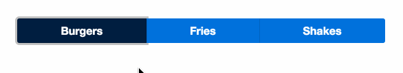

# 1.0 - Radio Component

Completer l'implémentation de _*app/radio.ts*_ et _*app/app-component.ts*_

## Resultat attendu

Le component radio devra:

- Accepter un tableau d'objet ou chaque objet posséde une propriété `title` et `value`.
- Le titre sera le text du bouton.
- Le composant devra aussi avoir un input `selected`.
- Lorsqu'un bouton est cliqué, la value du bouton devra etre assigné a la propriété selected du parent (utiliser Output et EventEmitter).

Vous devrez aussi assigner les différentes classes aux boutton selon leur position dans la liste (pensez à last et index):

- `bg-navy` si `button.value === selected`
- `rounded-left`: uniquement le premier boutton
- `border-left`: tous les boutton sauf le premier
- `not-rounded`: tous sauf le premier et le dernier
- `rounded-right`: le dernier bouton

