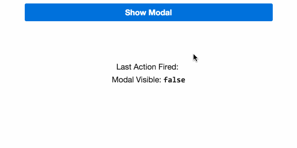

# 1.0 - Modal Component

Completer l'implémentation de _*app/modal.ts*_ de manière à pouvoir:

1. modifier la visibillité du modal à l'aide de la propriété : `isVisible`.

2. Brancher le button de manière à ce qu'il ferme le modal.

3. Utiliser ng-content afin de placer tous les `<button>`dans la troisième `div` du modal : `<!-- All actions go here -->`

4. Utiliser ng-content afin de placer tous les autres contenus dans la seconde `div` du modal: `<!-- All content goes here -->`

5. Utiliser un binding bi-directionnel pour la propriété `isVisible` du modal.


Completer l' implémentation de  _*app/app-component.ts*_ de manière à pouvoir:

1. Ce html devra ètre le contenu du modal.
  ```html
  <p class="m0">Bacon ipsum dolor sit amet chuck prosciutto landjaeger ham hock filet mignon shoulder hamburger pig venison. Ham bacon corned beef, sausage kielbasa flank tongue pig drumstick capicola swine short loin ham hock kevin. Bacon t-bone hamburger turkey capicola rump short loin.</p>
  ```

2. Ces boutton devront etre la partie action du modal.

  ```html
  <button class="btn caps"
    (click)="action('Share')">
    Share
  </button>
  <button class="btn caps"
    (click)="action('Explore')">
    Explore
  </button>
  ```

## Resultat attendu




