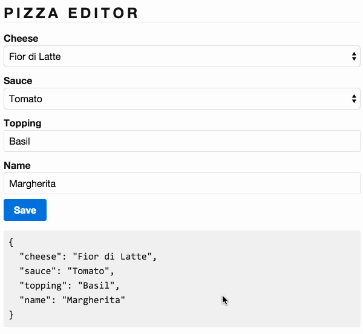

# 1.0 - Pizza Editor

Dans cet exercice vous allez devoir créer un formulaire editeur de pizza pour une pizzeria. Vous trouverer le modèle dans _*app/pizza.ts*_. Vous devez implémenter _*app/pizza-editor.ts*_ ainsi que _*app/pizza-editor.html*_ de manière à ce que l'utilisateur puisse modifier ces valeurs. Les valeurs accéptée pour `cheese` et `sauce` sont déjà dans le template. La méthode submit a déjà été implémenté.

## Expected Results

Une fois le formulaire remplis et le bouton `save` cliqué les valeurs dans dans la zone grisé devront être mises à jour.

