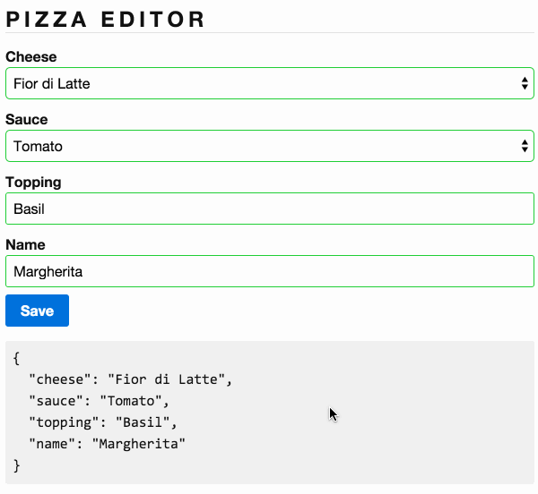

# 2.0 - Pizza Editor Validations

Maintenant que nous avons un editeur de pizza ajoutons un de validation. Implémentez _*app/pizza-editor.ts*_ et _*app/pizza-editor.html*_ de sorte que:

- `cheese`, `sauce` et `name` sont required.
- Tous les champs doivent avoir une bordure `red` s' ils ne sont pas valid et un`green` s'ils le sont. Utilisez la propriété `styles` du décorateur `@Component`.
- Afficher une alert `Name is required` si l'input est vide. L'alert box est fournis dans le template.
- Le bouton `save` devrait être desactivé tant que le form n'est pas valide.

## Resultats attendus

