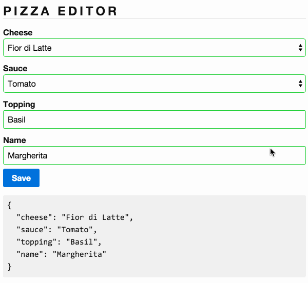

# 3.0 - Pizza Editor Custom Validations

En plus des validations de base que vous avez ajoutés avec brio, le pizzaloillo voudrait des validations "maison". Implémenter _*app/custom-validators.ts*_, _*app/pizza-editor.ts*_ et _*app/pizza-editor.html*_ afin d'ajouter deux validateurs custom:

1. **Acceptable Topping** L'utilisateur ne peut spécifier qu'un seul toppings, les toppings accepté sont listés ci dessous. L'input doit rester un input et étre sensible à la casse.

  ```js
  ['tomato', 'basil', 'garlic', 'eggplant', 'onion', 'salami', 'prosciutto']
  ```

2. **Duplicate Name** Intéroger le back-end pour voir si le name est déjà utiliser. La validation sera asynchrone (Promise....). Por simuler le coté asynchrone utiliser la fonction ci dessous:

  ```js
  setTimeout(() => {
    if (control.value.toLowerCase() === 'calabrese') {
      resolve(/* ERROR GOES HERE */);
    } else {
      resolve(null);
    }
  }, 1000);
  ```

Afficher les bons messages d'erreur lorsque la validation echoue.

Afficher le message `Checking name availability...` pendant l'execution de la validation asynchrone.


## Resultat attendu


