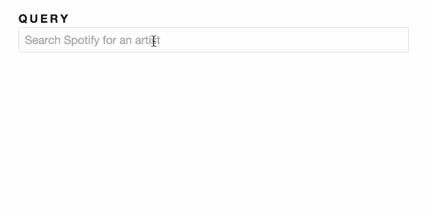

# 1.0 - Spotify Search

Implementer _*app/artist-search.ts*_  and _*app/search-service.ts*_ de sorte que:

1. Au fur et à mesure de la saisie utilisateur effecuer des appel http `GET` vers L'API Spotify et retourner une response `JSON`.

2. Assurer vous de ne pas overloader l'API en ajoutant la propriété debounce : `400ms`.

3. Reformater les données arrivante dan ce format :

  ```js
  [{
    name: 'artist.name',
    popularity: 'artist.popularity',
    image: 'artist.images[0].url'
    // ☝ if available otherwise use 'https://placehold.it/128?text=N%2FA'
  }]
  ```

_Hint:_ Penser à l'opéraeur `flatMap` Pour combiner deux observables.

## Resultat attendu


